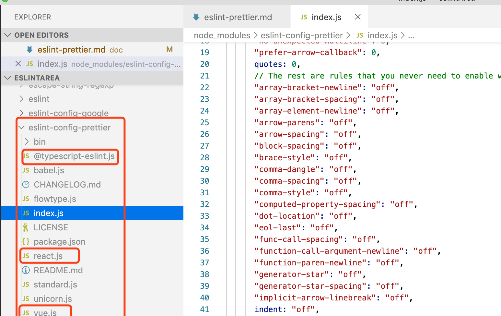
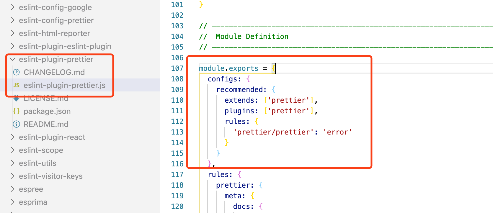

# ESLint 与 Prettier配合使用

- [安装Prettier](#install-prettier)
- [添加prettier配置文件](#add-prettier-config)
- [配合ESLint检测代码风格](#style-check-with-eslint)
- [解决与已存在的插件的冲突](#fix-plugin-conflict)
- [同时使用上面两项配置](#combine-config)
- [参考地址](#reference)

<h2 id="install-prettier">安装Prettier</h2>

```bash
npm i -D prettier
```

<h2 id="add-prettier-config">添加prettier配置文件</h2>

在项目的根目录下创建`.prettierrc.js`文件：

```js
module.exports = {
    printWidth: 80, //一行的字符数，如果超过会进行换行，默认为80
    tabWidth: 4, //一个tab代表几个空格数，默认为80
    useTabs: false, //是否使用tab进行缩进，默认为false，表示用空格进行缩进
    singleQuote: true, //字符串是否使用单引号，默认为false，使用双引号
    semi: false, //行位是否使用分号，默认为true
    trailingComma: 'all', //是否使用尾逗号，有三个可选值"<none|es5|all>"
    bracketSpacing: true, //对象大括号字面量是否有空格，默认为true，效果：{ foo: bar }
    parser: 'babylon', //代码的解析引擎，默认为babylon，与babel相同。
}
```
配置大概列出了这些，还有一些其他配置可以在[官方文档](https://prettier.io/docs/en/options.html)进行查阅。


<h2 id="style-check-with-eslint">配合ESLint检测代码风格</h2>

**安装插件**

```bash
npm i -D eslint-plugin-prettier
```
`eslint-plugin-prettier`插件会调用`prettier`对你的代码风格进行检查，其原理是先使用`prettier`对你的代码进行格式化，然后与格式化之前的代码进行对比，如果过出现了不一致，这个地方就会被`prettier`进行标记。

**添加规则**

在`rules`中添加，`"prettier/prettier": "error"`，表示被`prettier`标记的地方抛出错误信息。

```js
//.eslintrc.js
{
  "plugins": ["prettier"],
  "rules": {
    "prettier/prettier": "error"
  }
}
```
**自动修复错误**

借助ESLint的`autofix`功能，在保存代码的时候，自动将抛出`error`的地方进行`fix`.

<h2 id="fix-plugin-conflict">解决与已存在的插件的冲突</h2>

**安装依赖**

```bash
npm i -D eslint-config-prettier
```
通过使用`eslint-config-prettier`，能够关闭一些不必要的或者是与`prettier`冲突的lint选项。以`prettier`的样式规范为准, 这样我们就不会看到一些error同时出现两次。使用的时候需要确保，这个配置在`extends`的最后一项。

```js
//.eslintrc.js
{
  extends: [
    'standard', //使用standard做代码规范
    "prettier",
  ],
}
```
这里有个[文档](https://github.com/prettier/eslint-config-prettier#special-rules)，列出了会与prettier冲突的配置项。

**代码透视**




<h2 id="combine-config">同时使用上面两项配置</h2>

如果你同时使用了上述的两种配置，那么你可以通过如下方式，简化你的配置。

```js
//.eslintrc.js
{
  "extends": ["plugin:prettier/recommended"]
}
```
**This does three things:**

- Enables `eslint-plugin-prettier`.
- Sets the `prettier/prettier` rule to "error".
- Extends the `eslint-config-prettier` configuration.




<h2 id="reference">参考地址</h2>

- [eslint-plugin-prettier](https://www.npmjs.com/package/eslint-plugin-prettier)
- [eslint-config-prettier](https://www.npmjs.com/package/eslint-config-prettier)
- [使用ESLint+Prettier来统一前端代码风格](https://juejin.im/post/5b27a326e51d45588a7dac57)
- [在Typescript项目中，如何优雅的使用ESLint和Prettier](https://segmentfault.com/a/1190000019661168)
